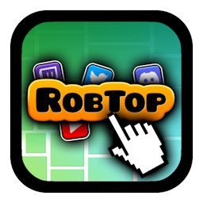
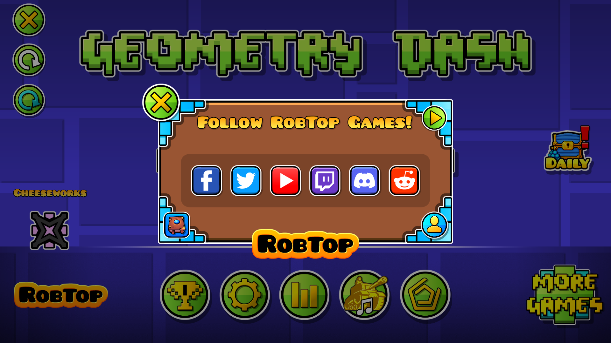

#  Clean RobTop Socials
Clean up RobTop's social media menu!

---

>   

>  
>  
> 

---

## About
This mod improves RobTop's social media UI on the main menu by moving all of Rob's social media buttons into a special pop-up.

---

### Use?
You can now stop misclicking those heckin' buttons! Open the pop-up by pressing the new *RobTop* button in that same corner. Pressing each social button in the pop-up will also open a confirmation pop-up asking if you want to proceed.

---

---

### Changelog
###### What's new?!
**[📜 View the latest updates and patches](./changelog.md)**

### Issues
###### What's wrong?!
**[⚠️ Report a problem with the mod](../../issues/)**